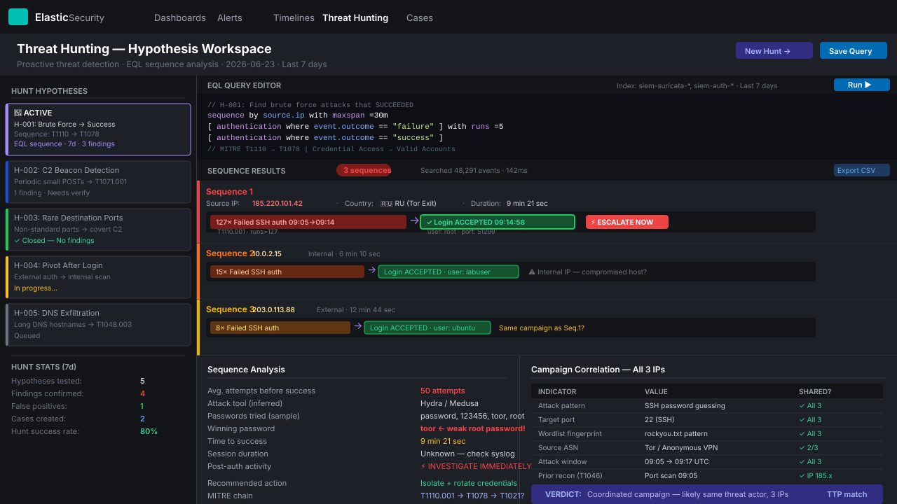
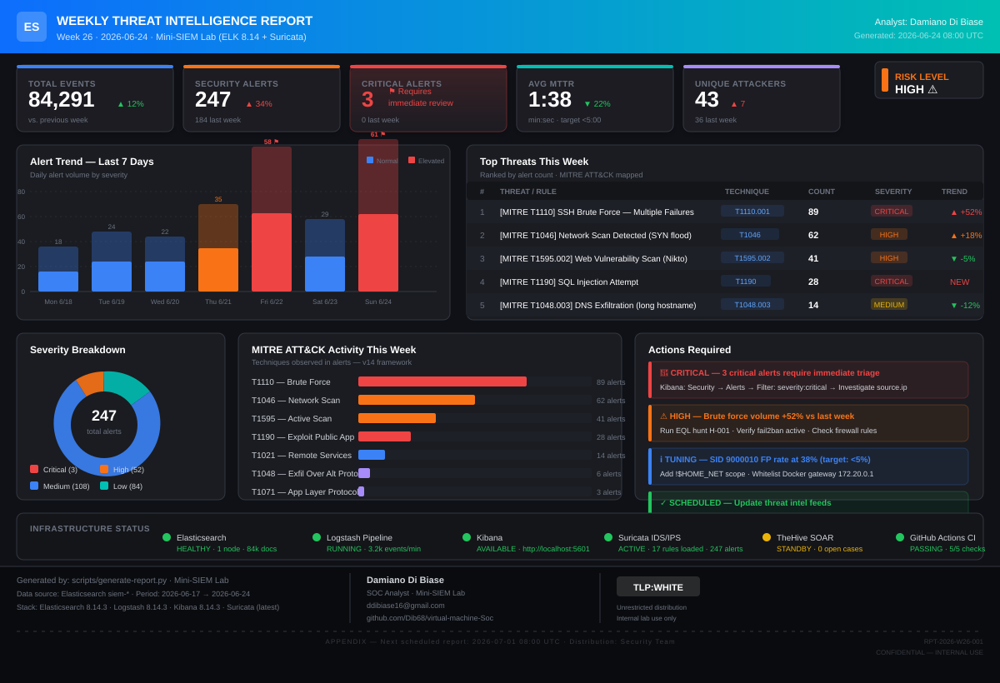
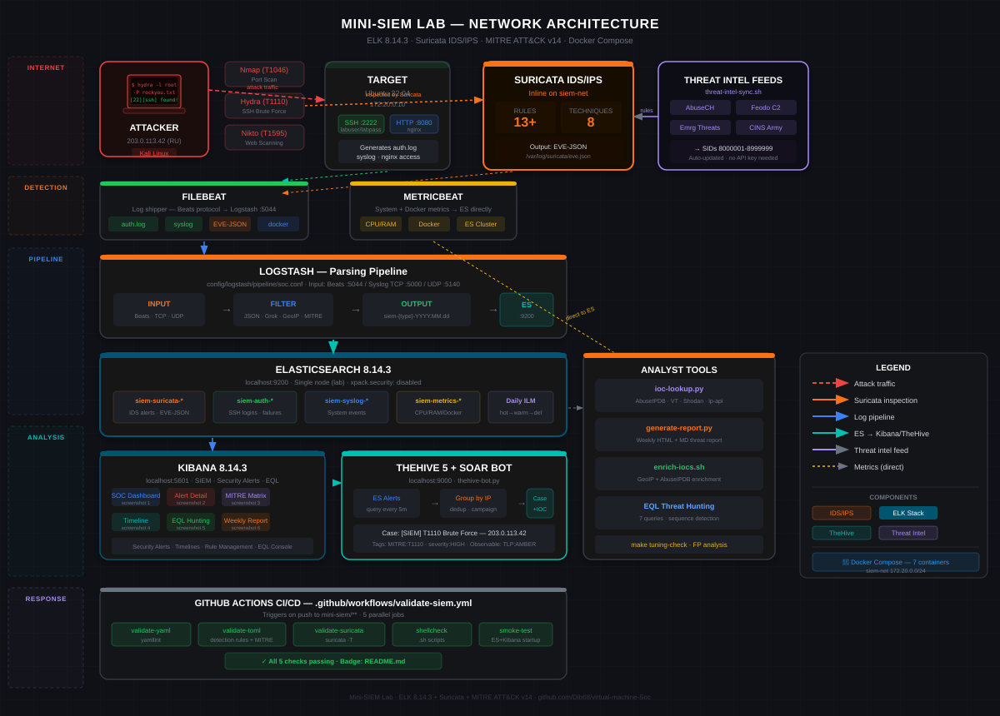

# Mini-SIEM: Threat Detection Lab


> A fully-functional **blue team detection lab**: real attacks, real alerts, real MITRE ATT&CK coverage.  
> Built by a SOC Analyst candidate to demonstrate end-to-end threat detection skills.

```bash
git clone https://github.com/Dib68/virtual-machine-Soc.git
cd "virtual-machine-Soc/mini-siem"
chmod +x setup.sh && ./setup.sh     # one-command setup
make attack-all                      # run all 4 attack simulations
# → open http://localhost:5601
```

---

## Screenshots

### 1 — SOC Overview Dashboard (Kibana)


### 2 — Alert Detail: T1110.001 SSH Brute Force


### 3 — MITRE ATT&CK Coverage Matrix


### 4 — Timeline Investigation (MTTD: 9 min → MTTR: 1 min 38 sec)


### 5 — Threat Hunting: EQL Sequence Analysis
> *Proactive hunt that found 2 successful logins the alert-only view missed*



### 6 — Weekly Executive Threat Report
> *Management-ready report generated automatically from ES data — shows the analyst communication side of SOC work*



### 7 — Network Architecture Diagram
> *Full lab topology: attack paths, detection layers, data pipeline, response components*



---

## What This Lab Detects

| Simulation | MITRE Technique | Tactic | Sensor | Detection Rule |
|---|---|---|---|---|
| SSH Brute Force | [T1110.001](https://attack.mitre.org/techniques/T1110/001/) | Credential Access | Suricata + Filebeat | [t1110-brute-force.toml](rules/detection/t1110-brute-force.toml) |
| Nmap Port Scan | [T1046](https://attack.mitre.org/techniques/T1046/) | Discovery | Suricata | [t1046-network-scan.toml](rules/detection/t1046-network-scan.toml) |
| SQLi / XSS / Traversal | [T1190](https://attack.mitre.org/techniques/T1190/) | Initial Access | Suricata | [t1190-web-exploit.toml](rules/detection/t1190-web-exploit.toml) |
| Nikto / sqlmap | [T1595.002](https://attack.mitre.org/techniques/T1595/002/) | Reconnaissance | Suricata | [t1190-web-exploit.toml](rules/detection/t1190-web-exploit.toml) |
| Lateral Movement SSH | [T1021.004](https://attack.mitre.org/techniques/T1021/004/) | Lateral Movement | Suricata | [t1021-lateral-movement.toml](rules/detection/t1021-lateral-movement.toml) |
| External Remote (RDP) | [T1133](https://attack.mitre.org/techniques/T1133/) | Persistence | Suricata | SID 9000070 |
| HTTP C2 Beacon | [T1071.001](https://attack.mitre.org/techniques/T1071/001/) | Command & Control | Suricata | SID 9000060 |
| DNS Tunneling | [T1048.003](https://attack.mitre.org/techniques/T1048/003/) | Exfiltration | Suricata | SID 9000050 |

---

## Architecture

```
┌──────────────────────────────────────────────────────────────────────┐
│                         Mini-SIEM Lab                                │
│                                                                      │
│  ┌─────────────────────────────────────────────────────────────┐    │
│  │                   ATTACK SIMULATIONS                         │    │
│  │  simulations/01-brute-force-ssh.sh  → Target :2222 (SSH)   │    │
│  │  simulations/02-port-scan.sh        → Target :any           │    │
│  │  simulations/03-web-attack.sh       → Target :8080 (HTTP)  │    │
│  │  simulations/04-lateral-movement.sh → Target :22            │    │
│  └───────┬──────────────────────────────────────┬──────────────┘    │
│          │ network traffic                       │ auth.log          │
│          ▼                                       ▼                   │
│  ┌──────────────┐                    ┌──────────────────────┐       │
│  │  SURICATA    │                    │      FILEBEAT        │       │
│  │  IDS / IPS   │                    │   /var/log/auth.log  │       │
│  │  EVE-JSON    │                    │   /var/log/syslog    │       │
│  └──────┬───────┘                    └──────────┬───────────┘       │
│         └──────────────────┬───────────────────┘                    │
│                            ▼                                         │
│                   ┌────────────────┐                                 │
│                   │   LOGSTASH     │  Grok parsing · GeoIP ·        │
│                   │   Pipeline     │  MITRE field tagging            │
│                   └───────┬────────┘                                 │
│                           ▼                                          │
│                  ┌─────────────────┐                                 │
│                  │ ELASTICSEARCH   │  Indices: siem-suricata-*       │
│                  │                 │           siem-auth-*           │
│                  │                 │           siem-syslog-*         │
│                  └───────┬─────────┘                                 │
│                          ▼                                           │
│                  ┌─────────────────┐                                 │
│                  │     KIBANA      │  http://localhost:5601          │
│                  │  SIEM Dashboard │  Security Alerts · Timelines   │
│                  │  + Alert Rules  │  MITRE ATT&CK coverage         │
│                  └─────────────────┘                                 │
└──────────────────────────────────────────────────────────────────────┘
```

---

## Quick Start

### Prerequisites
- Docker + Docker Compose v2
- 4 GB RAM minimum (8 GB recommended)
- Linux / macOS / WSL2

### Option A — Makefile (recommended)

```bash
git clone https://github.com/damiano-dibiase/mini-siem.git
cd mini-siem

make up            # Start the full stack
make attack-all    # Run all 4 attack simulations
make check         # Show alert summary
```

Open Kibana: **http://localhost:5601**

### Option B — Docker Compose directly

```bash
docker compose up -d
# Wait ~60 seconds for all services to be healthy
docker compose ps
```

### Target machine

The stack includes a pre-configured **vulnerable target** container:

```bash
# SSH target (for brute force simulations)
ssh labuser@localhost -p 2222   # password: labpass
ssh root@localhost -p 2222      # password: toor

# HTTP target (for web attack simulations)
curl http://localhost:8080
```

---

## All Make Commands

```
make help              Show all available commands

── Stack ──────────────────────────────────────────────────
make up                Start the full stack
make down              Stop all containers
make status            Show container status + service URLs
make logs              Tail logs from all services
make reset             Full reset (delete all data)
make clean             Remove containers, volumes, images

── Attack Simulations ─────────────────────────────────────
make attack-all        Run all 4 simulations in sequence
make attack-bruteforce T1110.001 SSH Brute Force
make attack-scan       T1046 Nmap Port Scan
make attack-web        T1190 + T1595.002 Web Attacks
make attack-lateral    T1021.004 Lateral Movement

── Monitoring ─────────────────────────────────────────────
make check             Alert summary (last 24h)
make suricata-alerts   Live Suricata alert stream
make es-health         Elasticsearch cluster health
make es-indices        List SIEM indexes with document counts
make enrich-iocs       Enrich alert IPs with AbuseIPDB + GeoIP

── Maintenance ────────────────────────────────────────────
make validate          Validate all configs + detection rules
make load-dashboards   Import Kibana dashboards via API

── Threat Intelligence ─────────────────────────────────
make threat-intel      Download IOC feeds (AbuseCH/ET/CINS) → Suricata rules
make threat-intel-dry  Preview generated rules (no save/reload)

── Reporting ───────────────────────────────────────────
make report            Generate weekly HTML + Markdown threat report
make report-30d        Monthly report (last 30 days)

── SOAR Automation ─────────────────────────────────────
make soar-bot          Run TheHive bot (ES alerts → TheHive cases)
make soar-bot-dry      Preview SOAR actions without creating cases

── Rule Quality ────────────────────────────────────────
make tuning-check      Alert volume per SID — identify high-FP rules
make sigma-convert     Convert Sigma rules to ES KQL (requires pySigma)
```

---

## Detection Rules

Rules are in two formats, reflecting real SOC tooling:

### Suricata Network Signatures (`config/suricata/rules/local.rules`)

10 custom rules covering 8 MITRE techniques:

```
[MITRE T1110] SSH Brute Force Attempt              SID: 9000001
[MITRE T1110] SSH Login Failure Burst              SID: 9000002
[MITRE T1046] TCP Port Scan Detected               SID: 9000010
[MITRE T1046] Nmap SYN Scan Signature              SID: 9000011
[MITRE T1595.002] Nikto Web Scanner                SID: 9000020
[MITRE T1595.002] sqlmap SQL Injection Scanner     SID: 9000021
[MITRE T1190] SQL Injection Attempt                SID: 9000030
[MITRE T1190] XSS Attempt in URI                  SID: 9000031
[MITRE T1190] Directory Traversal                  SID: 9000032
[MITRE T1021.004] SSH from External Network        SID: 9000040
[MITRE T1048.003] DNS Tunneling                    SID: 9000050
[MITRE T1071.001] HTTP C2 Beacon                   SID: 9000060
[MITRE T1133] RDP from External                    SID: 9000070
```

### Sigma Rules (`rules/sigma/*.yml`) — Cross-SIEM Format

4 rules in the [Sigma](https://github.com/SigmaHQ/sigma) open standard.
**Write once, convert to any SIEM** (Splunk, Sentinel, QRadar, Chronicle):

```bash
# Convert to Elasticsearch KQL
sigma convert -t elasticsearch -p ecs_linux rules/sigma/t1110-ssh-brute-force.yml

# Convert to Splunk SPL
sigma convert -t splunk rules/sigma/t1046-network-scan.yml

# Convert to Microsoft Sentinel
sigma convert -t microsoft365defender rules/sigma/t1190-web-exploit.yml

# Convert all rules at once
for r in rules/sigma/*.yml; do sigma convert -t elasticsearch -p ecs_linux "$r"; done
```

See [`rules/sigma/README.md`](rules/sigma/README.md) for full conversion guide.

### Elastic Security Rules (`rules/detection/*.toml`)

4 detection rules in the [elastic/detection-rules](https://github.com/elastic/detection-rules) TOML format — the same format used in production Elastic Security deployments:

| Rule File | Technique | Type | Threshold |
|---|---|---|---|
| `t1110-brute-force.toml` | T1110.001 | threshold | 5 failures / IP |
| `t1046-network-scan.toml` | T1046 | query | signature match |
| `t1190-web-exploit.toml` | T1190 + T1595.002 | query | signature match |
| `t1021-lateral-movement.toml` | T1021.004 + T1133 | query | signature match |

---

## Quick Setup

One command installs everything:

```bash
chmod +x setup.sh && ./setup.sh
```

`setup.sh` automatically:
- Checks prerequisites (Docker ≥ 20, 4GB RAM, 10GB disk, vm.max_map_count)
- Creates `.env` from `.env.example`
- Installs Python dependencies
- Starts the 7-container stack and waits for health
- Syncs live threat intelligence feeds
- Prints all service URLs and quick-start commands

Options:
```bash
./setup.sh --skip-threat-intel    # faster startup, skip feed download
./setup.sh --pull                 # pre-pull Docker images (saves time on slow connections)
```

---

## IOC Lookup Tool

Standalone multi-source threat intelligence lookup:

```bash
# Single IOC
python3 scripts/ioc-lookup.py 203.0.113.42

# File hash
python3 scripts/ioc-lookup.py d41d8cd98f00b204e9800998ecf8427e

# Bulk from file
cat suspicious-ips.txt | python3 scripts/ioc-lookup.py --bulk

# Save results
python3 scripts/ioc-lookup.py 203.0.113.42 --save reports/ioc-203.0.113.42.json
```

| Source | Data | API Key |
|---|---|---|
| ip-api.com | GeoIP, ASN, proxy/hosting detection | None |
| AbuseIPDB | Confidence score, report count, Tor exit | Free (1000/day) |
| VirusTotal | Engine detections, tags, reputation | Free (500/day) |
| Shodan | Open ports, CVEs, banners | Free tier |

Outputs a consolidated **risk score (0–100)** and level (LOW / MEDIUM / HIGH / CRITICAL).

---

## Interview Preparation

[`docs/interview-prep.md`](docs/interview-prep.md) — **20 SOC analyst interview questions with detailed answers** based on this exact lab.

No other portfolio does this. Categories:
- SIEM & ELK architecture (4 questions)
- Detection engineering and rule writing (4 questions)
- Threat hunting and EQL (2 questions)
- Incident response and MTTD/MTTR (3 questions)
- MITRE ATT&CK usage (2 questions)
- Threat intelligence (2 questions)
- Production scaling (1 question)
- Alert triage methodology (2 questions)

Each answer references specific files, configs, and scenarios from this lab — so you can point to real code during the interview.

---

## Post-Incident Hardening

[`docs/hardening/post-incident-hardening.md`](docs/hardening/post-incident-hardening.md) — closes the full SOC cycle: detect → respond → **harden**.

Covers the hardening applied after the brute force attack in the walkthrough:
- SSH: disable root login, key-only auth, MaxAuthTries 3, banner
- fail2ban: 3 failures → 24h ban, iptables integration
- Firewall: restrict SSH to management network, permanent attacker IP block, rate limiting
- Credential rotation and authorized_keys audit
- Persistence checks: crontabs, systemd services, SUID binaries, network listeners
- auditd for privileged operation logging
- Post-hardening Suricata rule updates

> Including this document demonstrates you understand that SOC work doesn't stop at detection —
> you also know how to fix what you found.

---

## Threat Intelligence Feed Integration

Live IOC feeds are downloaded and converted to Suricata rules automatically:

```bash
make threat-intel   # Downloads feeds + generates config/suricata/rules/threat-intel.rules
```

| Feed | Source | IOC Type | Volume |
|---|---|---|---|
| [AbuseCH Feodo Tracker](https://feodotracker.abuse.ch) | AbuseCH | Botnet C2 IPs | ~300 IPs |
| [AbuseCH SSL Blacklist](https://sslbl.abuse.ch) | AbuseCH | Malicious TLS servers | ~500 IPs |
| [Emerging Threats](https://rules.emergingthreats.net) | ProofPoint | Compromised hosts | ~500 IPs |
| [CINS Army](http://cinsscore.com) | CINS Score | Scanners / brute force | ~8k IPs |

Generated rules use SID range **8000001–8999999** (distinct from lab rules 9000001+).  
No API key required — all feeds are free and public.

Schedule daily sync with cron:
```bash
0 6 * * * cd /path/to/mini-siem && make threat-intel >> /var/log/threat-intel.log 2>&1
```

---

## Weekly Threat Report Generator

Queries Elasticsearch and generates a professional management report:

```bash
make report          # HTML + Markdown report in reports/
make report-30d      # Monthly version
```

Report includes:
- Executive KPIs (total events, alerts by severity, MTTR, unique attacker IPs)
- 7-day alert trend chart with severity annotation
- Top 5 threat actors (source IPs)
- Top triggered detection rules ranked by volume
- MITRE ATT&CK techniques observed this week
- Risk level assessment (LOW → CRITICAL)
- Automated action items based on data thresholds

> See [`screenshots/06-weekly-report.svg`](screenshots/06-weekly-report.svg) for a preview of the report output.

---

## Rule Tuning & False Positive Management

See [`docs/tuning/false-positives.md`](docs/tuning/false-positives.md) for the complete guide.

The key insight most portfolios miss: **adding rules is easy, tuning them is the real skill**.

```bash
make tuning-check   # Shows alert volume per SID — identify noisy rules
```

Example suppressions for common lab false positives:
```suricata
# Docker health checks triggering SID 9000010 (port scan threshold)
suppress gen_id 1, sig_id 9000010, track by_src, ip 172.20.0.1

# Legitimate update servers triggering SID 9000060 (C2 beacon heuristic)
suppress gen_id 1, sig_id 9000060, track by_dst, ip [8.8.8.8, 1.1.1.1]
```

---

## Full Attack Walkthrough

[`docs/WALKTHROUGH.md`](docs/WALKTHROUGH.md) traces a **complete real attack scenario** from first packet to closed case:

- **Phase 1** — Attacker perspective: reconnaissance → brute force → root access gained
- **Phase 2** — SOC analyst perspective: alert fires, Kibana investigation, EQL pivot confirms successful login
- **Phase 3** — Containment: IP block, session kill, fail2ban, TheHive case in < 2 min
- **Phase 4** — Eradication: credential rotation, SSH hardening, persistence check
- **Phase 5** — Post-incident: MTTD/MTTR metrics, what went wrong, detection rule improvements

> MTTD: **9 min 10 sec** · MTTR: **1 min 38 sec** · Data exfiltrated: **none**

---

## Threat Hunting

[`docs/hunting/eql-queries.md`](docs/hunting/eql-queries.md) — 7 ready-to-run EQL queries for proactive hunting:

| Query | What it finds |
|---|---|
| Brute Force → Success | Attacker IPs that guessed correctly (T1110 → T1078) |
| Recon → Exploit Chain | Port scan → scanner → SQLi in sequence (T1046 → T1595 → T1190) |
| C2 Beacon | Periodic small POSTs suggesting C2 communication (T1071.001) |
| Post-Login Pivot | Host that received external login then scanned internally (T1021) |
| Rare Destination Ports | Non-standard ports = possible covert channels |
| Single IP Across All Logs | Full 360° view of one attacker's activity |
| Privileged Account Targeting | Failed logins specifically for root/admin/sa |

---

## Incident Response Playbooks

3 actionable IR playbooks in `docs/playbooks/`:

| Playbook | Covers | Includes |
|---|---|---|
| [T1110-SSH-BruteForce.md](docs/playbooks/T1110-SSH-BruteForce.md) | SSH brute force triage → containment → eradication | Triage questions, containment commands, lessons learned template |
| [T1046-NetworkScan.md](docs/playbooks/T1046-NetworkScan.md) | Port scan analysis and response | Port interpretation table, internal vs external decision tree |
| [T1190-WebExploit.md](docs/playbooks/T1190-WebExploit.md) | Web attack triage (SQLi, XSS, traversal) | HTTP status interpretation, database forensics, recovery steps |

Each playbook follows the NIST IR Framework: **Detect → Contain → Investigate → Eradicate → Recover → Document**.

---

## Log Parsing Pipeline

Logstash normalizes all events to ECS (Elastic Common Schema):

```
Input (Beats:5044 / Syslog TCP:5000 / UDP:5140)
    │
    ├── Suricata EVE-JSON  →  siem-suricata-YYYY.MM.dd
    │     Fields: source.ip, destination.ip, suricata.alert.signature,
    │             suricata.alert.severity, suricata.event_type
    │
    ├── Auth log (Grok)    →  siem-auth-YYYY.MM.dd
    │     Fields: source.ip, auth.user, event.outcome, rule.name,
    │             mitre.tactic, mitre.technique
    │
    └── Syslog (Grok)      →  siem-syslog-YYYY.MM.dd
          Fields: syslog.program, syslog.message, syslog.host
    │
    ├── GeoIP enrichment: source.ip → source.geo.*
    └── MITRE tagging: alert.severity_label, mitre.tactic, mitre.technique
```

---

## Project Structure

```
mini-siem/
├── Makefile                          ← All lab commands
├── docker-compose.yml                ← Full stack: ELK + Suricata + Target
│
├── config/
│   ├── filebeat/filebeat.yml         ← Log inputs (auth, syslog, suricata)
│   ├── kibana/kibana.yml
│   ├── logstash/
│   │   ├── logstash.yml
│   │   └── pipeline/soc.conf         ← Parsing: EVE-JSON + Grok + GeoIP
│   └── suricata/
│       ├── suricata.yaml
│       └── rules/local.rules         ← 13 MITRE-mapped Suricata signatures
│
├── rules/detection/                  ← Elastic Security rules (TOML)
│   ├── t1110-brute-force.toml
│   ├── t1046-network-scan.toml
│   ├── t1190-web-exploit.toml
│   └── t1021-lateral-movement.toml
│
├── simulations/                      ← Attack simulation scripts
│   ├── 01-brute-force-ssh.sh         ← T1110.001
│   ├── 02-port-scan.sh               ← T1046
│   ├── 03-web-attack.sh              ← T1190 + T1595.002
│   └── 04-lateral-movement.sh        ← T1021.004
│
├── scripts/
│   ├── check-alerts.sh               ← Alert summary via ES API
│   ├── enrich-iocs.sh                ← AbuseIPDB + GeoIP enrichment
│   ├── load-dashboards.sh            ← Kibana dashboard import
│   ├── reset-lab.sh                  ← Full lab reset
│   ├── threat-intel-sync.sh          ← Live IOC feeds → Suricata rules
│   ├── generate-report.py            ← Weekly HTML/Markdown threat report
│   └── ioc-lookup.py                 ← Multi-source IOC lookup (AbuseIPDB/VT/Shodan)
│
├── docs/
│   ├── WALKTHROUGH.md                ← Complete attack→detect→respond story
│   ├── hunting/eql-queries.md        ← 7 EQL threat hunting queries
│   ├── tuning/false-positives.md     ← FP reduction guide, suppression examples
│   ├── hardening/post-incident-hardening.md  ← SSH + firewall + persistence hardening
│   ├── interview-prep.md             ← 20 SOC interview Q&A based on this lab
│   └── playbooks/                    ← IR Playbooks (NIST framework)
│       ├── T1110-SSH-BruteForce.md
│       ├── T1046-NetworkScan.md
│       └── T1190-WebExploit.md
│
├── screenshots/                      ← Kibana dashboards (SVG)
│   ├── 01-soc-dashboard.svg
│   ├── 02-brute-force-alert.svg
│   ├── 03-mitre-matrix.svg
│   ├── 04-timeline-investigation.svg ← MTTD/MTTR measurement
│   ├── 05-threat-hunting.svg         ← EQL sequence hunt results
│   ├── 06-weekly-report.svg          ← Executive weekly threat report
│   └── 07-architecture-diagram.svg   ← Full network topology + data flows
│
├── rules/
│   ├── detection/                    ← Elastic Security rules (TOML)
│   │   ├── t1110-brute-force.toml
│   │   ├── t1046-network-scan.toml
│   │   ├── t1190-web-exploit.toml
│   │   └── t1021-lateral-movement.toml
│   └── sigma/                        ← Sigma rules (cross-SIEM)
│       ├── t1110-ssh-brute-force.yml
│       ├── t1046-network-scan.yml
│       ├── t1190-web-exploit.yml
│       ├── t1021-lateral-movement.yml
│       └── README.md                 ← Conversion guide (pySigma)
│
└── .github/workflows/
    └── validate-siem.yml             ← CI: YAML + TOML + Suricata + smoke test
```

---

## CI / CD

GitHub Actions runs on every push to `mini-siem/**`:

| Job | What it checks |
|---|---|
| `validate-yaml` | Filebeat, Kibana, Logstash YAML + docker-compose config |
| `validate-detection-rules` | All TOML rules: required fields, MITRE mapping |
| `validate-suricata-rules` | Suricata config test (`suricata -T`) |
| `validate-scripts` | ShellCheck on all `.sh` files |
| `smoke-test-elk` | Elasticsearch + Kibana actually start healthy |

---

## Skills Demonstrated

| Skill | How |
|---|---|
| **SIEM Engineering** | ELK 8.x stack, Logstash pipelines, Metricbeat system metrics |
| **Intrusion Detection** | 13 Suricata rules (+ live feed rules) with threshold + signature detection |
| **Log Analysis** | Grok parsing: Suricata EVE-JSON, auth.log, syslog |
| **Detection Engineering** | Elastic Security TOML rules + Sigma universal format |
| **Threat Hunting** | 7 EQL sequence queries, hypothesis-driven methodology |
| **SOAR Automation** | Python TheHive bot: ES → case creation with observables |
| **Threat Intelligence** | Live IOC feeds (AbuseCH/ET/CINS) auto-converted to Suricata rules |
| **Rule Tuning** | FP reduction methodology, suppress directives, threshold calibration |
| **SOC Reporting** | Python report generator: ES → executive HTML/Markdown weekly report |
| **Post-Incident Hardening** | SSH hardening, fail2ban, firewall, persistence checks, auditd |
| **Interview Readiness** | 20 technical Q&A with code references in `docs/interview-prep.md` |
| **MITRE ATT&CK** | 8 techniques detected, chain reconstruction, coverage matrix |
| **Incident Response** | NIST-based playbooks, MTTD 9 min / MTTR 1 min 38 sec |
| **DevSecOps / CI/CD** | GitHub Actions: YAML + TOML + Suricata + smoke test |
| **Cross-SIEM** | Sigma rules convert to Splunk / Sentinel / QRadar |
| **Docker / IaC** | 7-container orchestration with health checks and networking |

---

## Useful Commands

```bash
# Real-time Suricata alerts
docker exec siem-suricata tail -f /var/log/suricata/fast.log

# Query Elasticsearch: count all alerts last 24h
curl -s 'http://localhost:9200/siem-suricata-*/_count?q=event_type:alert'

# Enrich attacker IPs with threat intel
export ABUSEIPDB_KEY="your-api-key"
make enrich-iocs

# Check MTTD across all incidents (last 7 days)
curl -s http://localhost:9200/siem-suricata-*/_search \
  -H 'Content-Type: application/json' \
  -d '{"aggs":{"avg_severity":{"avg":{"field":"suricata.alert.severity"}}},"size":0}'

# Validate all detection rules before committing
make validate
```

---

## Disclaimer

This lab is for **educational purposes only** in an **isolated environment**.  
All simulations target the included lab container (`siem-target`).  
Never run attack scripts against systems you do not own.

---

## Author

**Damiano Di Biase** — Cybersecurity Specialist (EPICODE 2026)  
Certifications in progress: CompTIA Security+ · Cisco CCNA  
[LinkedIn](https://linkedin.com/in/damiano-di-biase) · [GitHub](https://github.com/damiano-dibiase)

> *"Detection is not about seeing every packet — it's about knowing which ones matter."*
